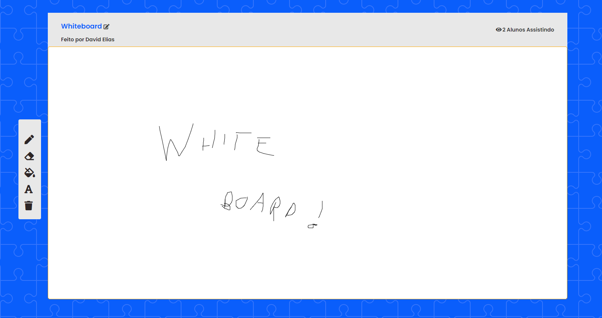

# Collaborative Whiteboard 



<br><br>
🎨 Desenhe junto com seus amigos utilizando nosso quadro branco

<br></br>
# Índice

* [Sobre o Projeto](#-O-que-é-isso?)
* [Instalação](#-installation)
* [Recursos do Projeto](#-Recursos)

<br></br>

# Sobre o Projeto

🎨 Uma aplicação criada com o intuito de criar um Quadro Branco onde é possivel desenhar em conjunto com outras pessoas na sala.

<br></br>
# Recursos

 - [x] Desenhar
 - [x] Apagar o desenho e começar do zero
 - [x] Desenho em Tempo Real com outras pessoas 
 - [ ]  Contador de Pessoas conectadas na sala
 - [ ]  Sistema de nomes
 - [ ]  Sistema de Separação por Lobby/Salas
 - [ ] Escolher o tipo de Pincel
 - [ ] Utilizar a Borracha
 - [ ] Ferramenta de Textos
 - [ ] Funçaõ de CTRL + Z


<br></br>
# Instalação

Certifique-se de ter o Node.js instalado.

Clone esse repositorio.

```cmd
$ git clone https://github.com/DavidEliass/Whiteboard-Collaborative.git

$ cd ./Whiteboard-Collaborative
```


## Instalação de dependências 

```javascript
$ npm install

Start the server

$ npm start
```


